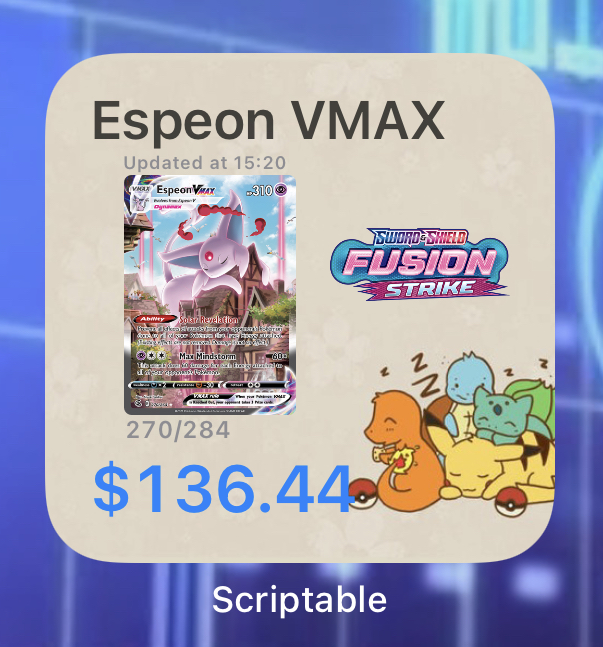
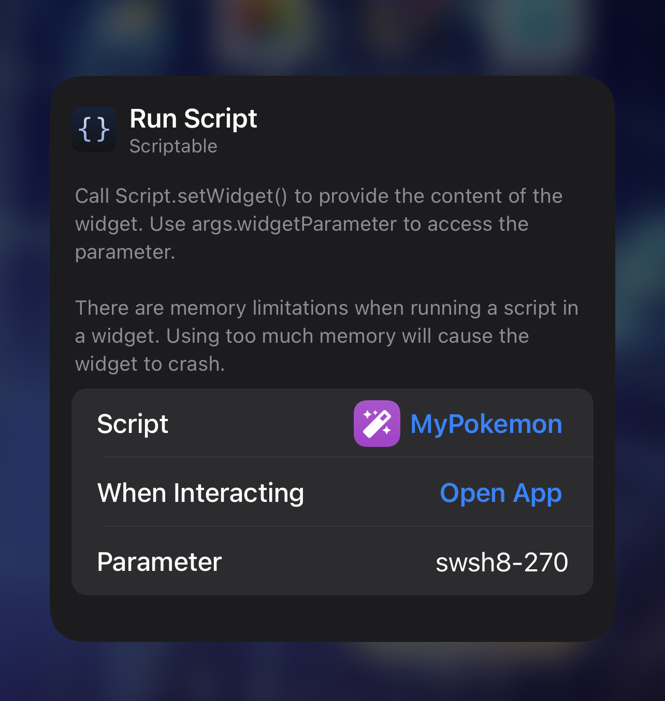

# PokeWidget
iOS Widget that displays Pokémon Card information and price.

## Setup
This widget uses the Pokémon TCG API (https://pokemontcg.io/)

In the widget Parameters, use the card ID that matches PokémonTCG API card ID.

Parameter: [Series][Set#]-[Card#]

Example: swsh8-270

(Use Pokémon TCG API documentation for more help: https://docs.pokemontcg.io/)

